# **Contagion**

## **This is an Android Chatting Application.**
### It has been developed mainly focusing on the academic activities of the Leading University teachers and students.  

## Purpose of this App
- For making academic activities related better communication system and will be able to make the biggest change in the way teachers and students interact with each other.
- The easiest way to know teachers and students information.
- Department wise communication facilities.
- Giving facilities of classroom to Leading University academic demand.
- To provide course wise easiest way Group Communication System.
- Easily getable department information.
- Community support.
- To report students without their identity in department head sir.   

## Features of this App
- Every field of Login & Registration is validated.
- Users will not be able to complete their registration without LU email.
- While users stay logged in to the app they will be shown online whenever they open the app.
- Users will be able to do real-time messaging with each other.
- Users will be able to do instant search with student ID from the student list.
- Users will be able to create their own profile.
- The list of department-based class representatives has been separated to easily find all the information of the class representatives.
- User's list has been separated according to the department.  

## Security of this App
- Messages have been end-to-end encrypted using AES Encryption.
- Users will receive verification in their LU email after completing the registration, and users will be able to login to this app after verifying verification.
- Users will be able to recover their password via email verification.
- Users must have a password of 8 characters and an uppercase, lowercase, number and numeric character when registering, otherwise users will not be able to complete their registration.  

## Future Work of this App

We will implement this feature:

- Group Messaging
- Anonymous Messaging
- Classroom
- Notice Board
- Routine
- Repoart Box

## **Application UI**

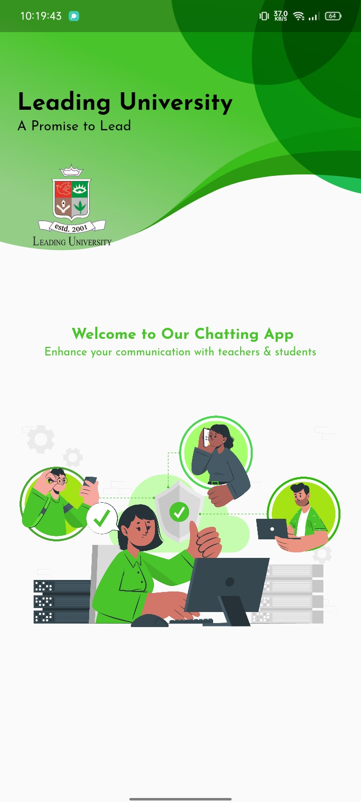
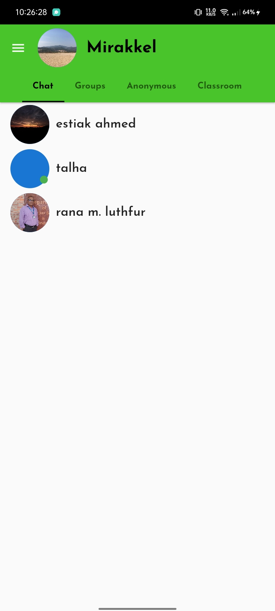
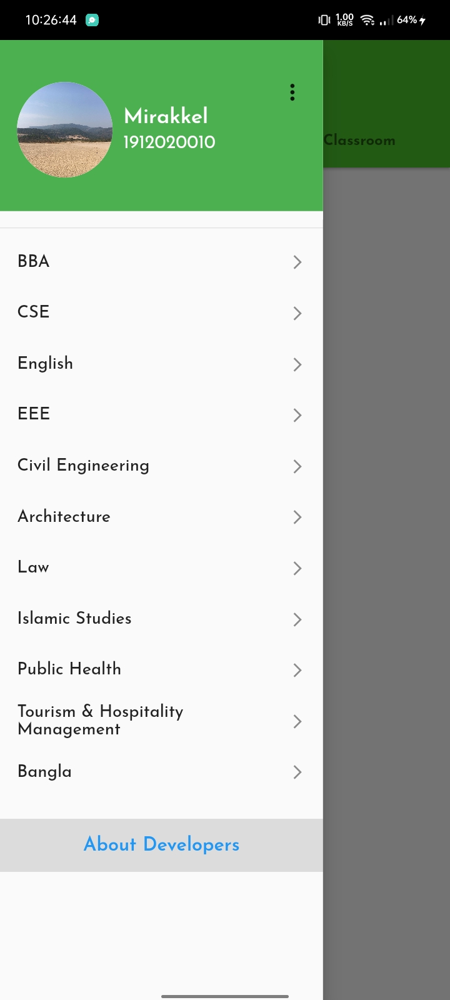

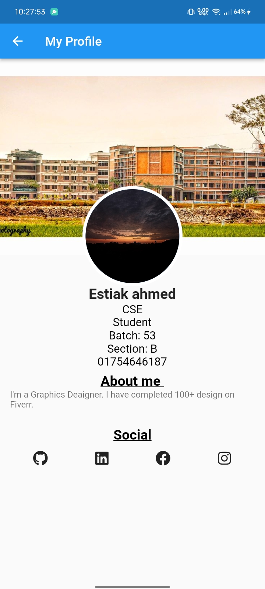
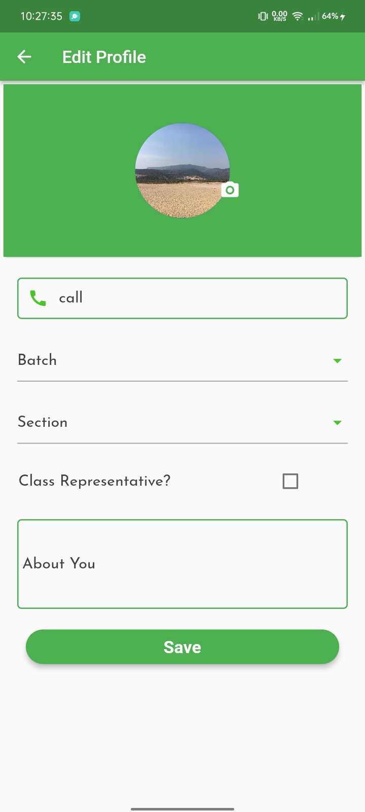
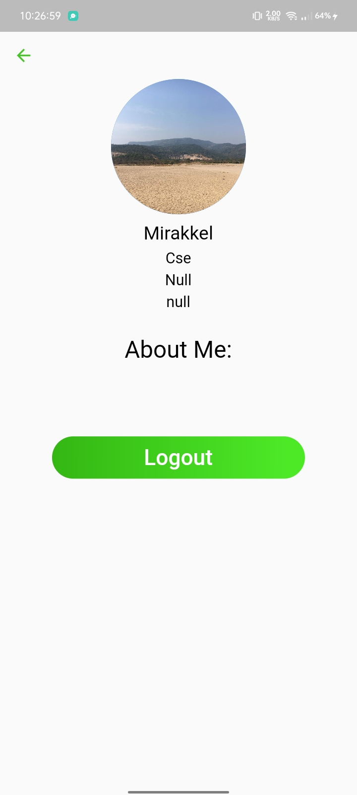
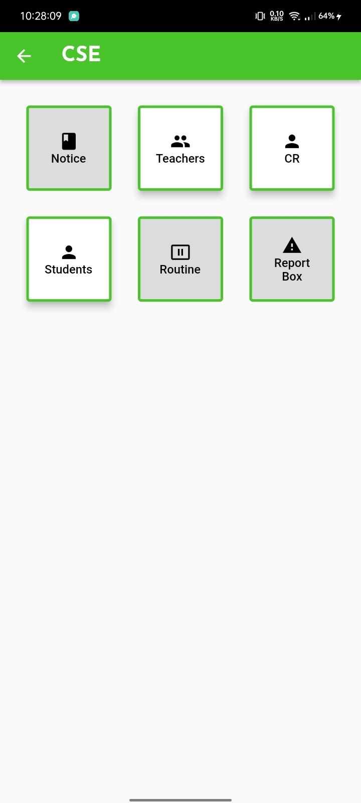
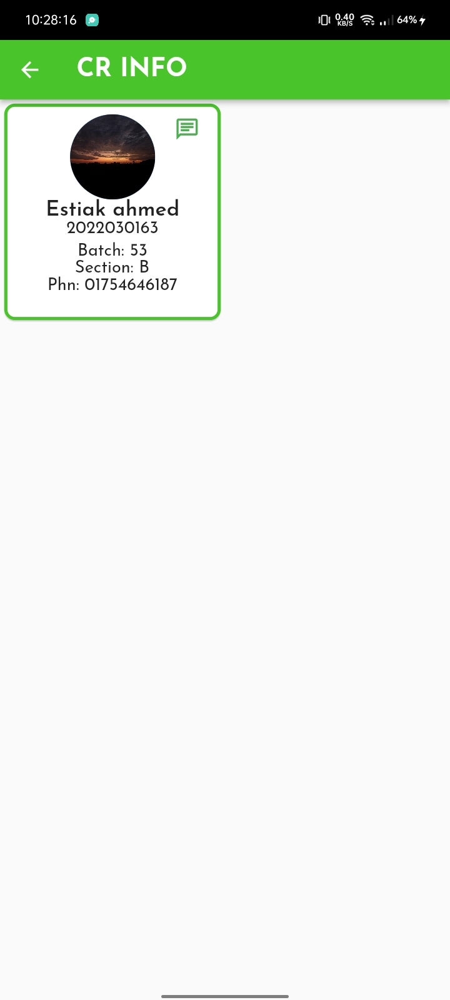
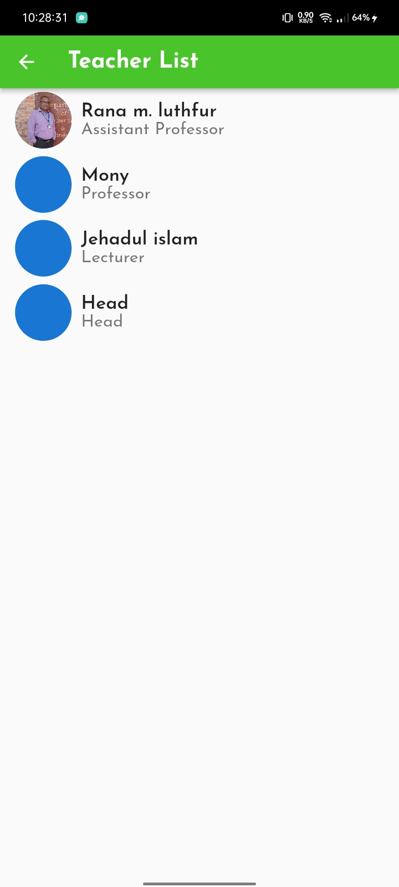
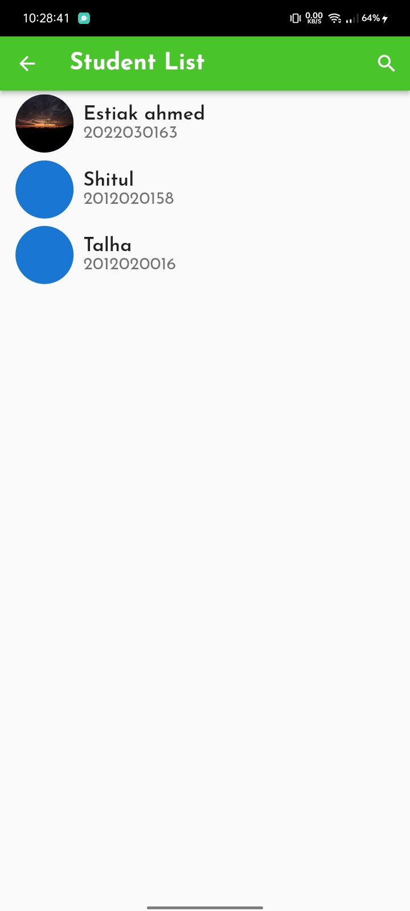
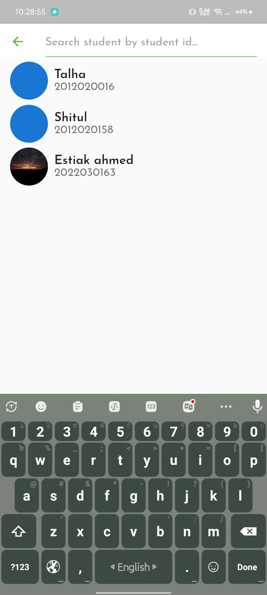
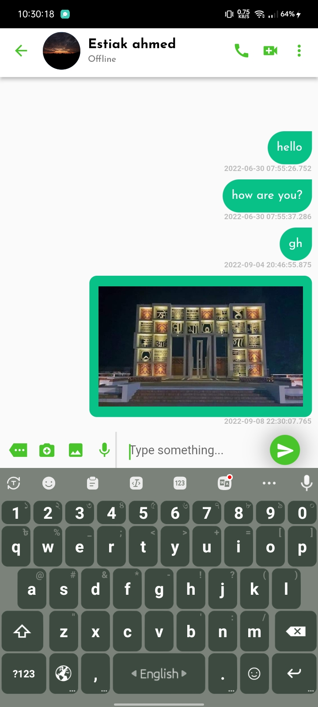